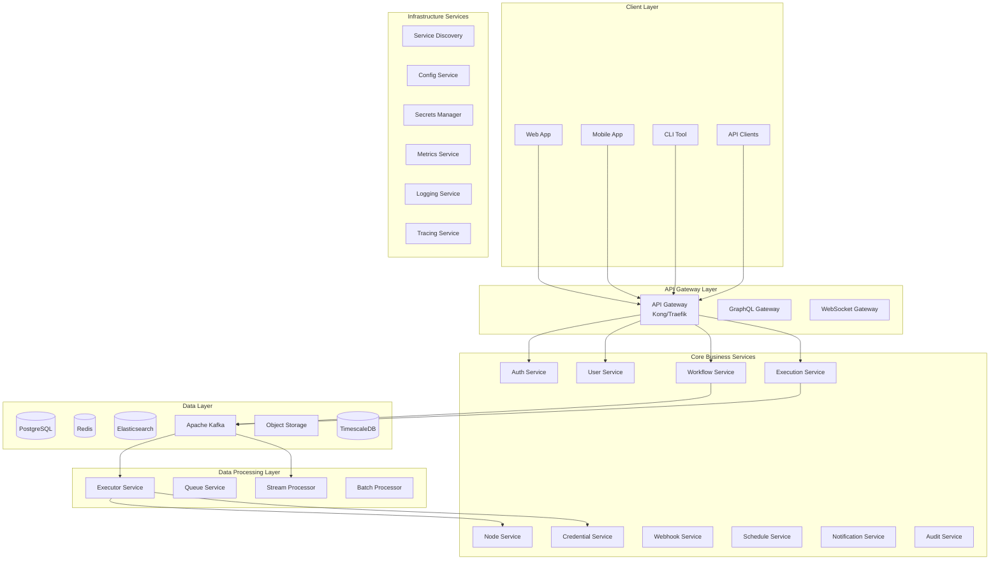

# 🚀 Advanced Microservices Architecture for n8n Clone

## Executive Summary

This document presents an **advanced microservices architecture** that transforms the n8n clone from a monolithic application into a **highly scalable, distributed system** capable of handling enterprise-grade workloads with millions of workflows and billions of executions.

### Key Architectural Decisions
- **Domain-Driven Microservices**: 15+ specialized services with clear boundaries
- **Event-Driven Architecture**: Apache Kafka/NATS for async communication
- **CQRS + Event Sourcing**: Separate read/write models with event replay
- **Service Mesh**: Istio for traffic management and observability
- **API Gateway**: Kong/Traefik for unified API management
- **Distributed Transactions**: Saga pattern for cross-service consistency
- **Multi-Region**: Active-active deployment across regions

---

## 🏗️ Service Architecture Overview

### Core Services Topology



---

## 📦 Microservices Breakdown

### 1. Authentication Service
**Responsibility**: User authentication, JWT management, OAuth2, SSO

```yaml
Service: auth-service
Port: 8001
Database: PostgreSQL (users, sessions, oauth_tokens)
Cache: Redis (session store, token blacklist)
Events Published:
  - user.registered
  - user.logged_in
  - user.logged_out
  - token.refreshed
  - password.reset
Events Consumed:
  - user.deleted
  - user.suspended
Technologies:
  - JWT with RS256
  - OAuth2.0 providers
  - SAML 2.0 for enterprise SSO
  - WebAuthn for passwordless
API Endpoints:
  POST   /auth/register
  POST   /auth/login
  POST   /auth/logout
  POST   /auth/refresh
  POST   /auth/verify-email
  POST   /auth/reset-password
  POST   /auth/oauth/{provider}
  POST   /auth/2fa/setup
  POST   /auth/2fa/verify
```

### 2. User Management Service
**Responsibility**: User profiles, teams, permissions, RBAC

```yaml
Service: user-service
Port: 8002
Database: PostgreSQL (users, teams, roles, permissions)
Cache: Redis (user profiles, permissions)
Events Published:
  - user.created
  - user.updated
  - user.deleted
  - team.created
  - team.member.added
  - role.assigned
Events Consumed:
  - auth.user.registered
  - workflow.created (for ownership)
Technologies:
  - RBAC with Casbin
  - GraphQL for complex queries
  - Profile image storage in S3
API Endpoints:
  GET    /users
  GET    /users/{id}
  PUT    /users/{id}
  DELETE /users/{id}
  GET    /users/{id}/permissions
  POST   /teams
  POST   /teams/{id}/members
  GET    /roles
  POST   /roles/{id}/assign
```

### 3. Workflow Service
**Responsibility**: Workflow CRUD, versioning, validation, templates

```yaml
Service: workflow-service
Port: 8003
Database: PostgreSQL (workflows, versions, templates)
Cache: Redis (active workflows, templates)
Events Published:
  - workflow.created
  - workflow.updated
  - workflow.activated
  - workflow.deactivated
  - workflow.deleted
  - workflow.version.created
Events Consumed:
  - execution.completed (for statistics)
  - node.created
  - credential.deleted
Technologies:
  - DAG validation
  - JSON Schema validation
  - Git-like versioning system
  - Template marketplace integration
API Endpoints:
  GET    /workflows
  POST   /workflows
  GET    /workflows/{id}
  PUT    /workflows/{id}
  DELETE /workflows/{id}
  POST   /workflows/{id}/activate
  POST   /workflows/{id}/deactivate
  GET    /workflows/{id}/versions
  POST   /workflows/{id}/rollback
  POST   /workflows/import
  GET    /workflows/export/{id}
  GET    /templates
  POST   /templates
```

### 4. Execution Service
**Responsibility**: Execution orchestration, state management, monitoring

```yaml
Service: execution-service
Port: 8004
Database: 
  - PostgreSQL (execution metadata)
  - TimescaleDB (time-series execution data)
  - S3 (execution data archives)
Cache: Redis (active executions, recent results)
Events Published:
  - execution.started
  - execution.completed
  - execution.failed
  - execution.cancelled
  - execution.retrying
  - node.execution.started
  - node.execution.completed
Events Consumed:
  - workflow.activated
  - trigger.fired
  - webhook.received
  - schedule.triggered
Technologies:
  - State machine with Temporal/Cadence
  - Distributed locks with Redis
  - Data partitioning by date
  - Compression for old data
API Endpoints:
  GET    /executions
  GET    /executions/{id}
  POST   /executions/start
  POST   /executions/{id}/stop
  POST   /executions/{id}/retry
  DELETE /executions/{id}
  GET    /executions/{id}/log
  GET    /executions/stats
  WS     /executions/{id}/stream
```

### 5. Executor Service (Worker Pool)
**Responsibility**: Actual workflow execution, node processing

```yaml
Service: executor-service
Port: N/A (Worker service)
Instances: 10-100 (auto-scaled)
Technologies:
  - Worker pool pattern
  - Kubernetes Jobs for isolation
  - Container per execution option
  - Resource limits and quotas
Queue: Kafka/RabbitMQ
Tasks:
  - Execute workflow
  - Execute node
  - Process parallel branches
  - Handle retries
  - Manage timeouts
Features:
  - Sandboxed execution environment
  - Resource monitoring
  - Graceful shutdown
  - Work stealing for load balancing
  - Priority queue support
```

### 6. Node Registry Service
**Responsibility**: Node type management, schemas, marketplace

```yaml
Service: node-service
Port: 8005
Database: PostgreSQL (node_types, schemas, versions)
Storage: S3 (node packages, icons)
Cache: Redis (popular nodes, schemas)
Events Published:
  - node.registered
  - node.updated
  - node.deprecated
Events Consumed:
  - execution.node.failed (for analytics)
Technologies:
  - Plugin architecture
  - WebAssembly for custom nodes
  - npm-like package registry
  - Semantic versioning
API Endpoints:
  GET    /nodes/types
  GET    /nodes/types/{type}
  POST   /nodes/register
  PUT    /nodes/types/{type}
  GET    /nodes/schemas/{type}
  POST   /nodes/test
  GET    /nodes/marketplace
  POST   /nodes/install
```

### 7. Credential Service
**Responsibility**: Secure credential storage, encryption, OAuth tokens

```yaml
Service: credential-service
Port: 8006
Database: PostgreSQL (credentials, oauth_tokens)
Vault: HashiCorp Vault (secrets storage)
Cache: Redis (decrypted credentials with TTL)
Events Published:
  - credential.created
  - credential.updated
  - credential.deleted
  - credential.tested
Events Consumed:
  - user.deleted
  - oauth.token.refreshed
Technologies:
  - HashiCorp Vault integration
  - AES-256-GCM encryption
  - OAuth2 token refresh automation
  - Key rotation system
API Endpoints:
  GET    /credentials
  POST   /credentials
  GET    /credentials/{id}
  PUT    /credentials/{id}
  DELETE /credentials/{id}
  POST   /credentials/{id}/test
  POST   /credentials/{id}/rotate
  GET    /credentials/types
```

### 8. Webhook Service
**Responsibility**: Webhook management, ingestion, routing

```yaml
Service: webhook-service
Port: 8007
Database: PostgreSQL (webhooks, routes)
Cache: Redis (webhook routes, rate limits)
Events Published:
  - webhook.received
  - webhook.processed
  - webhook.failed
Technologies:
  - Dynamic routing table
  - Rate limiting per endpoint
  - Webhook signature validation
  - Request/response logging
  - Retry with exponential backoff
API Endpoints:
  GET    /webhooks
  POST   /webhooks
  DELETE /webhooks/{id}
  ANY    /w/{path} (webhook ingestion)
  GET    /webhooks/{id}/logs
  POST   /webhooks/{id}/replay
```

### 9. Schedule Service
**Responsibility**: Cron scheduling, timezone management

```yaml
Service: schedule-service
Port: 8008
Database: PostgreSQL (schedules, timezones)
Cache: Redis (next run times)
Events Published:
  - schedule.triggered
  - schedule.created
  - schedule.updated
  - schedule.missed
Technologies:
  - Distributed cron with leader election
  - Timezone-aware scheduling
  - Misfire policies
  - Holiday calendar support
API Endpoints:
  GET    /schedules
  POST   /schedules
  PUT    /schedules/{id}
  DELETE /schedules/{id}
  GET    /schedules/{id}/next-runs
  POST   /schedules/{id}/pause
  POST   /schedules/{id}/resume
```

### 10. Notification Service
**Responsibility**: Email, SMS, push notifications, alerts

```yaml
Service: notification-service
Port: 8009
Database: PostgreSQL (templates, logs)
Queue: Kafka (notification events)
Events Consumed:
  - execution.failed
  - execution.completed
  - user.registered
  - workflow.shared
Technologies:
  - Template engine (Handlebars)
  - Multiple providers (SendGrid, Twilio, FCM)
  - Batching for efficiency
  - Delivery tracking
  - Unsubscribe management
API Endpoints:
  POST   /notifications/send
  GET    /notifications/templates
  POST   /notifications/templates
  GET    /notifications/{id}/status
  POST   /notifications/preferences
```

### 11. Audit Service
**Responsibility**: Audit logging, compliance, activity tracking

```yaml
Service: audit-service
Port: 8010
Database: 
  - PostgreSQL (audit_logs)
  - Elasticsearch (searchable logs)
Storage: S3 (long-term archives)
Events Consumed:
  - *.* (all events for audit)
Technologies:
  - Immutable audit trail
  - Encryption at rest
  - Compliance reports (SOC2, GDPR)
  - Forensic analysis tools
API Endpoints:
  GET    /audit/logs
  GET    /audit/logs/{id}
  GET    /audit/reports
  GET    /audit/compliance/{standard}
  GET    /audit/user/{userId}
  GET    /audit/workflow/{workflowId}
```

### 12. Analytics Service
**Responsibility**: Metrics, dashboards, usage analytics

```yaml
Service: analytics-service
Port: 8011
Database:
  - TimescaleDB (time-series metrics)
  - ClickHouse (analytics)
  - Redis (real-time counters)
Events Consumed:
  - execution.* (all execution events)
  - workflow.* (workflow events)
Technologies:
  - Real-time analytics pipeline
  - Custom metrics definition
  - Anomaly detection
  - Predictive analytics
API Endpoints:
  GET    /analytics/dashboard
  GET    /analytics/metrics
  POST   /analytics/query
  GET    /analytics/reports
  GET    /analytics/usage
  GET    /analytics/performance
```

### 13. File Storage Service
**Responsibility**: File uploads, binary data, exports

```yaml
Service: storage-service
Port: 8012
Storage: 
  - S3/MinIO (object storage)
  - CDN (file delivery)
Database: PostgreSQL (file metadata)
Technologies:
  - Multipart upload
  - Virus scanning
  - Image processing
  - File compression
  - Signed URLs for direct upload
API Endpoints:
  POST   /storage/upload
  GET    /storage/files/{id}
  DELETE /storage/files/{id}
  POST   /storage/presigned-url
  GET    /storage/quota
```

### 14. Search Service
**Responsibility**: Full-text search, workflow discovery

```yaml
Service: search-service
Port: 8013
Database: Elasticsearch
Technologies:
  - Full-text search
  - Faceted search
  - Fuzzy matching
  - Search suggestions
  - Relevance tuning
API Endpoints:
  GET    /search
  GET    /search/workflows
  GET    /search/executions
  GET    /search/nodes
  GET    /search/suggest
  POST   /search/reindex
```

### 15. Billing Service
**Responsibility**: Usage tracking, billing, subscriptions

```yaml
Service: billing-service
Port: 8014
Database: PostgreSQL (subscriptions, invoices)
Integration: Stripe/Paddle
Events Published:
  - subscription.created
  - subscription.upgraded
  - payment.successful
  - payment.failed
Technologies:
  - Stripe/Paddle integration
  - Usage-based billing
  - Metered billing
  - Invoice generation
  - Dunning management
API Endpoints:
  GET    /billing/subscription
  POST   /billing/subscribe
  PUT    /billing/subscription
  DELETE /billing/subscription
  GET    /billing/usage
  GET    /billing/invoices
  POST   /billing/payment-method
```

---

## 🔄 Event-Driven Architecture

### Event Bus Design

```yaml
Message Broker: Apache Kafka / NATS
Patterns:
  - Event Sourcing for audit trail
  - CQRS for read/write separation
  - Saga pattern for distributed transactions
  - Event streaming for real-time updates

Topic Structure:
  - workflow.events
  - execution.events
  - user.events
  - system.events
  - audit.events

Event Schema:
  {
    "eventId": "uuid",
    "eventType": "workflow.created",
    "aggregateId": "workflow-id",
    "aggregateType": "workflow",
    "timestamp": "2024-01-01T00:00:00Z",
    "userId": "user-id",
    "payload": {},
    "metadata": {
      "correlationId": "uuid",
      "causationId": "uuid",
      "version": "1.0"
    }
  }
```

### Saga Orchestration

```yaml
Workflow Execution Saga:
  1. Start Execution
     → Reserve Resources
     → Validate Credentials
     → Initialize Context
  
  2. Process Nodes
     → For each node:
        - Acquire Lock
        - Execute Node
        - Store Result
        - Release Lock
  
  3. Complete Execution
     → Aggregate Results
     → Update Statistics
     → Send Notifications
     → Archive Data

Compensation on Failure:
  - Rollback partial executions
  - Release locked resources
  - Notify error handlers
  - Update failure metrics
```

---

## 🌐 API Gateway Architecture

### Gateway Configuration

```yaml
API Gateway: Kong / Traefik
Features:
  - Rate limiting (per user/IP)
  - API key management
  - OAuth2/JWT validation
  - Request/response transformation
  - Circuit breaking
  - Load balancing
  - Caching
  - CORS handling
  - WebSocket support
  - GraphQL federation

Route Configuration:
  /api/v1/auth/**     → auth-service
  /api/v1/users/**    → user-service
  /api/v1/workflows/** → workflow-service
  /api/v1/executions/** → execution-service
  /api/v1/nodes/**    → node-service
  /api/v1/webhooks/** → webhook-service
  /api/graphql        → graphql-gateway
  /ws/**              → websocket-gateway

Rate Limits:
  - Anonymous: 100 req/hour
  - Authenticated: 1000 req/hour
  - Premium: 10000 req/hour
  - Enterprise: Unlimited
```

### GraphQL Federation

```graphql
# Federated Schema
type Query {
  # User Service
  me: User
  users(filter: UserFilter): [User!]!
  
  # Workflow Service
  workflows(filter: WorkflowFilter): [Workflow!]!
  workflow(id: ID!): Workflow
  
  # Execution Service
  executions(filter: ExecutionFilter): [Execution!]!
  execution(id: ID!): Execution
}

type Mutation {
  # Auth Service
  login(email: String!, password: String!): AuthPayload!
  
  # Workflow Service
  createWorkflow(input: CreateWorkflowInput!): Workflow!
  updateWorkflow(id: ID!, input: UpdateWorkflowInput!): Workflow!
  
  # Execution Service
  executeWorkflow(workflowId: ID!): Execution!
}

type Subscription {
  executionUpdates(executionId: ID!): ExecutionUpdate!
  workflowChanges(workflowId: ID!): WorkflowChange!
}
```

---

## 🛡️ Service Mesh Architecture

### Istio Service Mesh

```yaml
Features:
  - mTLS between services
  - Traffic management
  - Circuit breaking
  - Retry policies
  - Timeout handling
  - Canary deployments
  - A/B testing
  - Distributed tracing

Traffic Policies:
  - Retry: 3 attempts with exponential backoff
  - Timeout: 30s default, 5m for long operations
  - Circuit Breaker: Open after 5 failures
  - Load Balancing: Round-robin with health checks

Security Policies:
  - mTLS: STRICT mode
  - Authorization: RBAC policies
  - Rate Limiting: Per service quotas
  - Network Policies: Zero-trust networking
```

---

## 💾 Data Architecture

### Database Strategy

```yaml
Primary Databases:
  PostgreSQL:
    - Master: Writes
    - Read Replicas: 3x for reads
    - Partitioning: By date for executions
    - Sharding: By user_id for multi-tenant
  
  TimescaleDB:
    - Time-series data
    - Execution metrics
    - Performance data
    - Auto-compression for old data
  
  Elasticsearch:
    - Full-text search
    - Audit logs
    - Application logs
    - Analytics data

Caching Strategy:
  Redis Cluster:
    - Session store
    - API cache (5 min TTL)
    - Workflow cache (10 min TTL)
    - Rate limiting counters
    - Distributed locks
  
  CDN:
    - Static assets
    - Workflow templates
    - Node packages
```

### Data Consistency Patterns

```yaml
Patterns:
  Strong Consistency:
    - User authentication
    - Workflow CRUD
    - Credential management
  
  Eventual Consistency:
    - Execution statistics
    - Analytics data
    - Audit logs
  
  Cache-Aside Pattern:
    - Read frequently, write rarely
    - Workflows, Templates
  
  Write-Through Cache:
    - Session data
    - User preferences
```

---

## 📊 Observability Stack

### Monitoring & Alerting

```yaml
Metrics: Prometheus + Grafana
  - Service metrics (requests, latency, errors)
  - Business metrics (workflows, executions)
  - Infrastructure metrics (CPU, memory, disk)
  - Custom metrics via OpenTelemetry

Logging: ELK Stack
  - Elasticsearch: Log storage
  - Logstash: Log processing
  - Kibana: Log visualization
  - Filebeat: Log shipping

Tracing: Jaeger
  - Distributed request tracing
  - Service dependency mapping
  - Performance bottleneck analysis
  - Error propagation tracking

Alerting Rules:
  - Service down > 1 minute
  - Error rate > 1%
  - P95 latency > 1 second
  - Disk usage > 80%
  - Execution queue depth > 1000
```

### SLO/SLI Definitions

```yaml
Service Level Objectives:
  API Availability: 99.95%
  Execution Success Rate: 99.9%
  P95 API Latency: < 200ms
  P95 Execution Start Time: < 1s
  Data Durability: 99.999999%

Service Level Indicators:
  - Request success rate
  - Request latency percentiles
  - Execution completion rate
  - Queue processing time
  - Database query performance
```

---

## 🚀 Deployment Architecture

### Kubernetes Configuration

```yaml
Namespace Structure:
  - n8n-production
  - n8n-staging
  - n8n-development

Resource Allocation:
  Auth Service: 2-10 pods, 500Mi-2Gi RAM
  Workflow Service: 3-20 pods, 1Gi-4Gi RAM
  Execution Service: 5-50 pods, 2Gi-8Gi RAM
  Executor Workers: 10-100 pods, 4Gi-16Gi RAM

Autoscaling:
  HPA:
    - CPU > 70%
    - Memory > 80%
    - Custom metrics (queue depth)
  
  VPA:
    - Automatic resource adjustment
    - Based on historical usage

Storage:
  - PersistentVolumes for databases
  - Object storage for files
  - EmptyDir for temporary data
```

### Multi-Region Deployment

```yaml
Regions:
  Primary: us-east-1
  Secondary: eu-west-1
  Tertiary: ap-southeast-1

Data Replication:
  - PostgreSQL: Streaming replication
  - Redis: Redis Sentinel
  - Kafka: MirrorMaker 2
  - S3: Cross-region replication

Traffic Distribution:
  - GeoDNS for region routing
  - Regional API gateways
  - Cross-region failover
  - Data locality optimization
```

---

## 🔒 Security Architecture

### Zero-Trust Security Model

```yaml
Network Security:
  - Service mesh mTLS
  - Network policies
  - Private subnets
  - WAF protection
  - DDoS mitigation

Authentication & Authorization:
  - OAuth2/OIDC
  - JWT with RS256
  - RBAC with Casbin
  - API key management
  - Service accounts

Data Security:
  - Encryption at rest (AES-256)
  - Encryption in transit (TLS 1.3)
  - Key management (HashiCorp Vault)
  - Secrets rotation
  - Data masking

Compliance:
  - GDPR compliance
  - SOC2 Type II
  - ISO 27001
  - HIPAA ready
  - PCI DSS Level 1
```

---

## 📈 Scalability Targets

### Performance Metrics

```yaml
Scale Targets:
  - 1M+ workflows
  - 100M+ executions/month
  - 10K+ concurrent executions
  - 100K+ API requests/second
  - 1M+ WebSocket connections
  - 10TB+ data processed/day

Latency Targets:
  - API response: P50 < 50ms, P99 < 200ms
  - Workflow start: P50 < 200ms, P99 < 1s
  - Node execution: P50 < 100ms, P99 < 500ms
  - WebSocket message: P50 < 10ms, P99 < 50ms

Throughput:
  - 10K workflows/second creation
  - 100K executions/second
  - 1M nodes/second processing
  - 10M events/second streaming
```

---

## 🛠️ Development & Testing

### Service Development Kit

```go
// Base service structure
package service

type BaseService struct {
    Config     *Config
    Logger     *Logger
    Metrics    *Metrics
    Tracer     *Tracer
    Health     *HealthChecker
    Database   *Database
    Cache      *Cache
    EventBus   *EventBus
}

// Service interface
type Service interface {
    Start(ctx context.Context) error
    Stop(ctx context.Context) error
    Health() HealthStatus
    Ready() bool
}

// Event handler
type EventHandler interface {
    Handle(ctx context.Context, event Event) error
    EventType() string
}

// Repository pattern
type Repository[T any] interface {
    Create(ctx context.Context, entity T) error
    Get(ctx context.Context, id string) (T, error)
    Update(ctx context.Context, entity T) error
    Delete(ctx context.Context, id string) error
    List(ctx context.Context, filter Filter) ([]T, error)
}
```

### Testing Strategy

```yaml
Unit Tests:
  - Coverage: > 80%
  - Mock external dependencies
  - Table-driven tests
  - Property-based testing

Integration Tests:
  - Service-to-service communication
  - Database interactions
  - Message queue integration
  - API contract testing

End-to-End Tests:
  - Critical user journeys
  - Cross-service workflows
  - Performance regression tests
  - Chaos engineering

Load Testing:
  - k6 for API load testing
  - Locust for workflow testing
  - Apache JMeter for complex scenarios
  - Gatling for real-time monitoring
```

---

## 🎯 Migration Strategy

### Phase 1: Strangler Fig Pattern
```yaml
Duration: 2 months
Goals:
  - Set up infrastructure
  - Deploy API Gateway
  - Create first 3 services
  - Implement event bus
Actions:
  1. Deploy Kubernetes cluster
  2. Set up API Gateway
  3. Extract Auth Service
  4. Extract User Service
  5. Extract Workflow Service
  6. Implement event streaming
```

### Phase 2: Core Services
```yaml
Duration: 3 months
Goals:
  - Extract execution logic
  - Implement service mesh
  - Set up monitoring
Actions:
  1. Extract Execution Service
  2. Create Executor Workers
  3. Implement Node Service
  4. Deploy Istio mesh
  5. Set up Prometheus/Grafana
```

### Phase 3: Advanced Features
```yaml
Duration: 2 months
Goals:
  - Complete service extraction
  - Implement CQRS
  - Add advanced features
Actions:
  1. Extract remaining services
  2. Implement event sourcing
  3. Add GraphQL gateway
  4. Implement saga pattern
  5. Multi-region setup
```

### Phase 4: Optimization
```yaml
Duration: 1 month
Goals:
  - Performance tuning
  - Security hardening
  - Production readiness
Actions:
  1. Performance optimization
  2. Security audit
  3. Load testing
  4. Documentation
  5. Training
```

---

## 📊 Cost Optimization

### Resource Optimization

```yaml
Compute:
  - Spot instances for workers (70% cost saving)
  - Reserved instances for core services
  - Auto-scaling based on demand
  - Serverless for infrequent tasks

Storage:
  - S3 Intelligent-Tiering
  - Data compression
  - Archive old executions
  - Cleanup policies

Network:
  - CDN for static content
  - Regional data locality
  - Compression for API responses
  - Connection pooling

Database:
  - Read replicas for queries
  - Partitioning for large tables
  - Index optimization
  - Query caching
```

---

## 🔧 Tooling & Automation

### CI/CD Pipeline

```yaml
Build Pipeline:
  1. Code commit
  2. Run tests
  3. Build Docker image
  4. Security scanning
  5. Push to registry
  6. Update Helm chart
  7. Deploy to staging
  8. Run E2E tests
  9. Deploy to production
  10. Monitor deployment

Tools:
  - GitLab CI / GitHub Actions
  - ArgoCD for GitOps
  - Helm for package management
  - Flux for continuous deployment
  - Tekton for cloud-native CI/CD
```

### Development Tools

```yaml
Local Development:
  - Tilt for local Kubernetes
  - Skaffold for hot reload
  - Telepresence for remote debugging
  - Docker Compose for simple setups

Code Quality:
  - SonarQube for code analysis
  - Snyk for vulnerability scanning
  - Trivy for container scanning
  - OPA for policy enforcement

Documentation:
  - OpenAPI/Swagger for APIs
  - AsyncAPI for events
  - Backstage for developer portal
  - Docusaurus for documentation
```

---

## 🎓 Team Structure

### Service Ownership

```yaml
Platform Team:
  - Infrastructure management
  - Service mesh
  - Observability stack
  - Security policies

Core Services Team:
  - Auth & User services
  - Workflow & Execution services
  - API Gateway

Integration Team:
  - Node Service
  - Webhook Service
  - Third-party integrations

Data Team:
  - Analytics Service
  - Search Service
  - Data pipeline

SRE Team:
  - Monitoring & alerting
  - Incident response
  - Performance optimization
  - Disaster recovery
```

---

## 📚 Key Design Patterns

### Microservices Patterns

```yaml
Service Communication:
  - API Gateway Pattern
  - Service Mesh Pattern
  - Circuit Breaker Pattern
  - Retry with Backoff
  - Bulkhead Pattern

Data Management:
  - Database per Service
  - CQRS Pattern
  - Event Sourcing
  - Saga Pattern
  - Outbox Pattern

Deployment:
  - Blue-Green Deployment
  - Canary Release
  - Feature Flags
  - Rolling Updates
  - Shadow Deployment

Resilience:
  - Circuit Breaker
  - Retry Pattern
  - Timeout Pattern
  - Fallback Pattern
  - Health Check Pattern
```

---

## 🏁 Success Criteria

### Technical KPIs

```yaml
Performance:
  - P99 latency < 200ms
  - Throughput > 100K RPS
  - Zero downtime deployments
  - Recovery time < 5 minutes

Reliability:
  - Uptime: 99.99%
  - Data durability: 99.999999%
  - Error rate < 0.01%
  - MTTR < 30 minutes

Scalability:
  - Auto-scale in < 1 minute
  - Support 10x traffic spikes
  - Linear scaling with resources
  - No single points of failure

Security:
  - Zero security breaches
  - Compliance certifications
  - Automated security scanning
  - Regular penetration testing
```

---

## 🚦 Go/No-Go Checklist

### Production Readiness

- [ ] All services deployed and tested
- [ ] Service mesh configured
- [ ] Monitoring and alerting active
- [ ] Disaster recovery tested
- [ ] Security audit completed
- [ ] Load testing passed
- [ ] Documentation complete
- [ ] Team trained
- [ ] Runbooks prepared
- [ ] SLOs defined and monitored

---

## 🎉 Conclusion

This advanced microservices architecture provides:

1. **Extreme Scalability**: Handle millions of workflows and billions of executions
2. **High Availability**: 99.99% uptime with zero-downtime deployments
3. **Global Distribution**: Multi-region active-active deployment
4. **Enterprise Security**: Zero-trust model with complete audit trail
5. **Developer Productivity**: Self-service platform with excellent tooling
6. **Cost Efficiency**: Optimized resource usage with auto-scaling
7. **Future-Proof**: Extensible architecture ready for new requirements

The architecture is designed to evolve from the current monolithic structure using the Strangler Fig pattern, allowing gradual migration without disrupting existing functionality.

**Total Implementation Timeline: 8 months**
**Team Size Required: 15-20 engineers**
**Estimated Cloud Cost: $50-100K/month at scale**

This architecture positions the n8n clone as an enterprise-grade, cloud-native workflow automation platform capable of competing with the largest players in the market.
